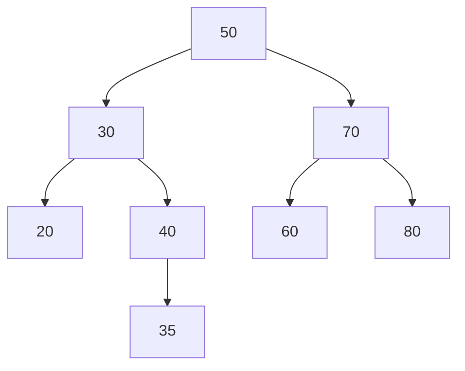
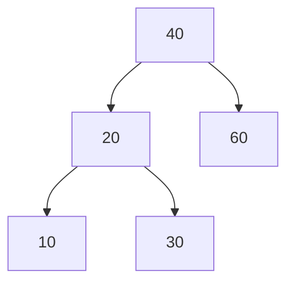
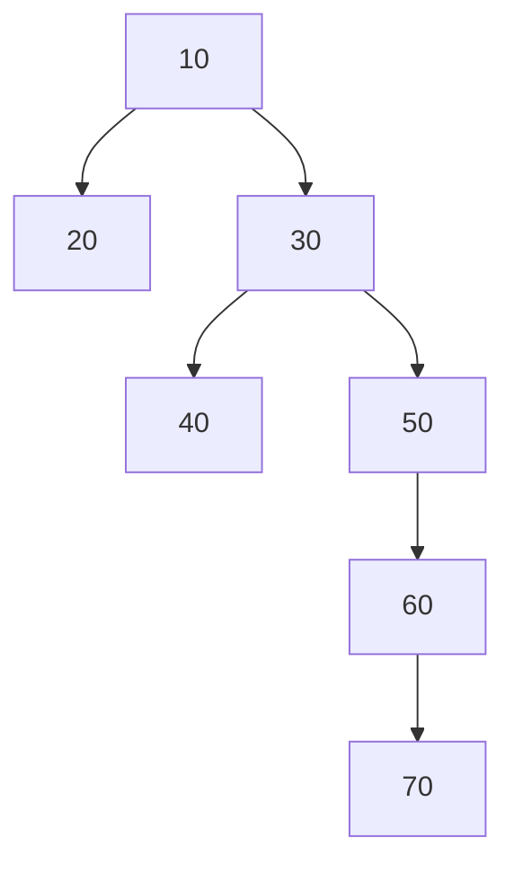
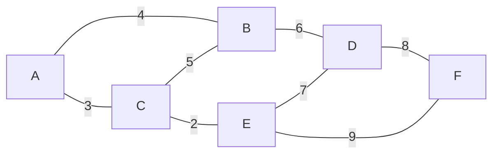
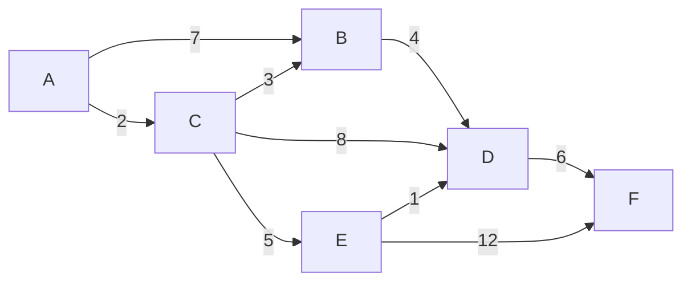

# アルゴリズムとデータ構造テスト

- 日程: [[Daily/2026/08/2026-08-05|2026-08-05]]
- 授業: [[アルゴリズムとデータ構造]]

## 試験範囲

- [ ] 試験範囲を確認する

## 対策

- [ ] 主要なアルゴリズムを整理する
- [ ] 計算量を確認する
- [ ] 演習問題を解く
- [ ] 間違えた問題を解き直す

## メモ

## 当日の振り返り

## 2026-08-05 期末試験問題

> 令和8年度 情報・知能工学系「アルゴリズムとデータ構造」期末試験  
> 実施日: 2026-08-05（水）  
> 写真から問題文を転記した。氏名・学籍番号・手書きの解答やメモは省略し、図はMermaidで再構成した。

### 問（1）ハッシュ表：チェイン法【配点10点】

ロボ子さんは、配信の視聴者ID（整数）を管理するために、スロット数 \(m=5\) のハッシュ表をチェイン法（chaining）で運用している。ハッシュ関数は \(h(k)=k \bmod 5\) である。空のハッシュ表に、以下の7個のキーをこの順で挿入する。

\[
12,\ 7,\ 22,\ 3,\ 18,\ 15,\ 9
\]

1. 挿入完了後の各スロットの内容を答えよ（各スロットに入るキーをすべて書け。空のスロットには「×」を書く。スロット内の順序は問わない）。【4点】
2. このハッシュ表の占有率（load factor）\(\alpha\) を求めよ。【2点】
3. 単純一様ハッシュの仮定の下で、チェイン法による探索の期待実行時間を \(\alpha\) を用いた \(\Theta\) 記法で答えよ。【2点】
4. チェイン法による探索が最悪 \(\Theta(n)\) になるのは、\(n\) 個のキーがどのような状態になったときか。答えよ。【2点】

### 問（2）ハッシュ表：オープンアドレス指定法【配点10点】

スロット数 \(m=11\) のハッシュ表を、オープンアドレス指定法・線形探査（linear probing）で運用する。ハッシュ関数は

\[
h(k,i)=((k \bmod 11)+i)\bmod 11
\]

である（\(i=0,1,2,\ldots\) は探査回数）。空のハッシュ表に、以下の6個のキーをこの順で挿入する。

\[
20,\ 31,\ 9,\ 42,\ 25,\ 14
\]

1. 挿入完了後のハッシュ表の状態を配列の表に書け（空のスロットには「×」を書く）。【8点】
2. 挿入の過程で発生した衝突（すでに埋まっているスロットへの探査）の総回数を答えよ。【2点】

### 問（3）二分探索木【配点10点】

図1の二分探索木について、以下の問いに答えよ。

1. 中間順なぞり（INORDER-WALK）を実行したときのキーの出力列を書け。【4点】
2. `MINIMUM`（最小キーの探索）を根から実行したとき、たどるノードのキーを順に書け。【2点】
3. キー50のノードの次節点（successor）のキーを答えよ。【2点】
4. キー40のノードの次節点（successor）のキーを答えよ。【2点】

### 問（4）AVL木への挿入と回転【配点12点】

図2のAVL木について、以下の問いに答えよ。

1. この木に5を挿入した。AVL木の条件を回復するために必要な回転操作を行った後の木を図示せよ。【5点】
2. 1とは独立に、元の木（図2）に25を挿入した。回転操作を行った後の最終的な木を図示せよ。【5点】
3. 1、2でそれぞれ行った回転操作の名称を答えよ。【2点】

### 問（5）素集合データ構造（Union-Find）【配点10点】

図3は、素集合データ構造のある集合を表す木である（辺は親子関係を表し、根は10である）。この木に対して、経路圧縮（path compression）付きの `FIND-SET(70)` を実行する。

1. `FIND-SET(70)` が返す値（集合の代表元）を答えよ。【2点】
2. 実行後、根10の直接の子となっている節点の個数を答えよ。【3点】
3. 実行後の節点40の親を答えよ。【2点】
4. 続けて `FIND-SET(40)` を実行した。実行後の木の高さを答えよ（根の高さを0とする）。【3点】

### 問（6）動的計画法：最長共通部分列（LCS）【配点14点】

大空スバルさんのファンは、配信の挨拶で「しゅばしゅば」とコメントする。いま、2つの文字列

\[
X=\mathrm{SUBARU}\quad (m=6), \qquad
Y=\mathrm{SHUBA}\quad (n=5)
\]

の最長共通部分列（LCS）を動的計画法で求めたい。\(c[i,j]\) は、\(X\) の接頭辞 \(X[1..i]\) と \(Y\) の接頭辞 \(Y[1..j]\) のLCSの長さとする。

1. 解答用紙のDP表をすべて埋めよ（\(i=0\) の行と \(j=0\) の列は0で埋めてある）。【8点】
2. LCSの長さ \(|LCS(X,Y)|\) を答えよ。【2点】
3. \(LCS(X,Y)\) そのもの（文字列）を答えよ。【4点】

### 問（7）最小全域木：Primのアルゴリズム【配点10点】

ホロライブの6人のタレントA〜Fの間でコラボ配信ネットワークを作ることになった。頂点はタレント、辺の重みはコラボ調整コストを表す重み付き無向グラフが図4で与えられる。全員がつながる調整コスト最小のネットワーク（最小全域木; MST）を、頂点Aを始点とするPrimのアルゴリズムで求める。

1. 頂点がMSTに追加される順序を書け（Aを1番目とする）。【6点】
2. 得られるMSTの重みの合計を答えよ。【4点】

### 問（8）最短路：Dijkstraのアルゴリズム【配点14点】

図5の重み付き有向グラフに対して、頂点Aを始点とするDijkstraのアルゴリズムを実行する。

1. アルゴリズム終了時の、各頂点への最短距離 \(d[A]\)〜\(d[F]\) を答えよ。【8点】
2. 頂点の最短距離が確定する（`EXTRACT-MIN` で取り出される）順序を書け。【6点】

### 問（9）後半のまとめ【配点10点（各1点）】

次の文章の空欄①〜⑩に当てはまる語句を、下の選択肢a〜oから選び記号で答えよ（同じ記号を2回以上使ってはならない）。

データの格納と検索を効率化するために、様々なデータ構造を学んだ。ハッシュ表では、キーをスロット番号に写す（①）を用いる。異なるキーが同じスロットに写ることを（②）と呼び、チェイン法では占有率 \(\alpha=n/m\) を用いて、探索の期待実行時間は（③）と表される。

二分探索木（BST）の各操作の実行時間は木の（④）に比例するため、最悪の場合（⑤）かかってしまう。この欠点を解消するのが平衡探索木であり、AVL木は（⑥）操作によって、どの節点でも左右の部分木の高さの差を1以下に保ち、操作を最悪でも \(O(\lg n)\) で実行できる。

素集合データ構造（Union-Find）は、ランクによる合併と（⑦）を併用することで、1操作あたりのならし計算量をほぼ定数にできる。

アルゴリズム設計の技法として、（⑧）と重複部分問題の2つの性質を持つ問題には動的計画法が有効である。一方、最小全域木を求めるPrimのアルゴリズムや、最短路を求めるDijkstraのアルゴリズムは、その時点で最も良さそうな選択を繰り返す（⑨）に基づいており、いずれも（⑩）を用いて効率的に実装できる。

**選択肢**

- a. 線形探査
- b. \(\Theta(n)\)
- c. 回転
- d. 最適部分構造
- e. 衝突
- f. \(\Theta(\lg n)\)
- g. ハッシュ関数
- h. 優先度付きキュー
- i. 高さ
- j. \(\Theta(1+\alpha)\)
- k. 貪欲法
- l. 併合
- m. 経路圧縮
- n. \(\Theta(\alpha^2)\)
- o. 節点数
